# Captures d'écran

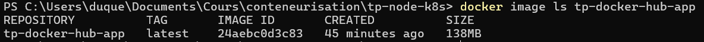

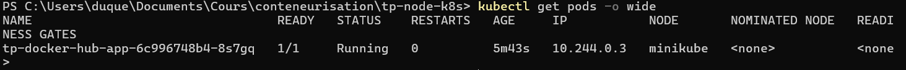

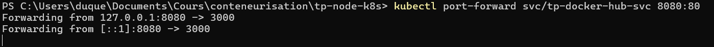

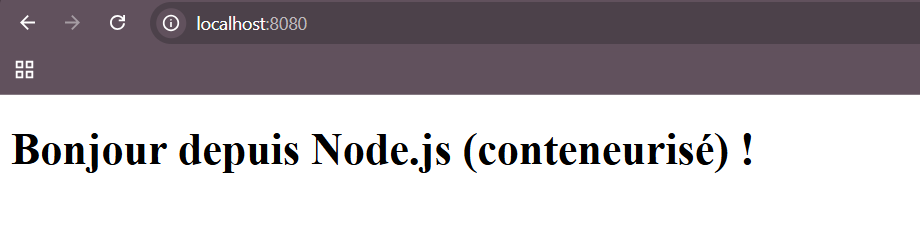

# Réponses

**1. 3 optimisations mises en place dans le Dockerfile et pourquoi.**

Le Dockerfile utilise un multi-stage build pour réduire la taille de l’image finale en séparant les dépendances et l’exécution.
La commande npm ci permet une installation plus rapide et reproductible des dépendances.
Enfin, seuls les fichiers nécessaires sont copiés dans l’image finale, ce qui améliore la sécurité et réduit la taille.

**2. À quoi sert imagePullSecrets et comment vous l’avez configuré.**

imagePullSecrets permet à Kubernetes de s’authentifier auprès d’un registre privé pour télécharger une image.
Il est configuré en créant un secret Docker (kubectl create secret docker-registry) contenant les identifiants, puis en le référencant dans le Deployment avec imagePullSecrets.

J’ai créé le imagePullSecret avec la commande suivante :

```
kubectl create secret docker-registry regcred \
  --docker-server=https://index.docker.io/v1/ \
  --docker-username=<mon_user_dockerhub> \
  --docker-password=<mon_token> \
  --docker-email=<mon_email>
```

# Bonus
### replicas
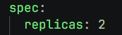
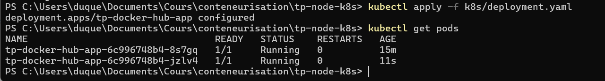

### request limit
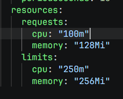

### autoscale

```
minikube addons enable metrics-server
```

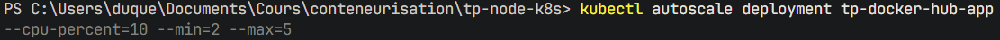

des que le cpu passe a plus de 10 % -> créer un nouveau pod (min 2, max 5)
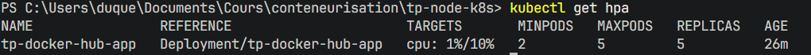

on va augmenter la charge
```
while ($true) { Invoke-WebRequest http://localhost:8080 }
```
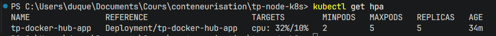
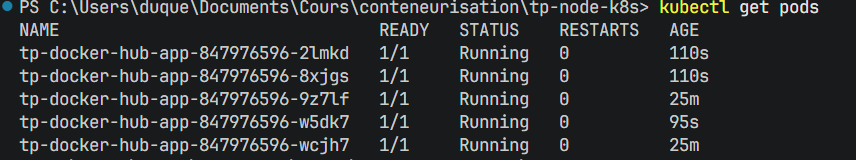